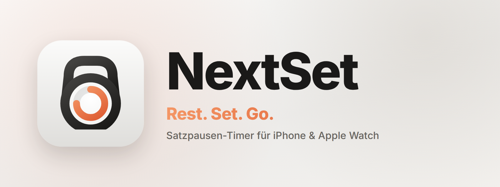

# NextSet

**Rest timer between sets for iPhone & Apple Watch, Android & Wear OS.** Tap one of your one or two quick timers and the rest starts. You feel the last seconds on your wrist or your phone and hear them too. Then it's on to your next set.

The repository is a monorepo: `ios/` holds the Swift apps for iPhone and Apple Watch, `android/` the native Android version (Kotlin, Jetpack Compose) for phone and Wear OS. Both versions behave the same; the timer logic is ported line by line and covered by the same tests.

## Name & logo

**NextSet** says what it's about: the app tells you when your *next set* starts. The tagline **"Rest. Set. Go."** is a play on "Ready, Set, Go".

The **logo** is a kettlebell whose body is also a timer dial. Handle and bell form the silhouette of a stopwatch, and the coral ring shows the rest running down. So the logo stands for the gym and the timer at once.

**Colours:** graphite, white and glass shape the app and keep it calm and simple. Colour only appears when it matters: in the last seconds the ring and the digits light up in coral. Coral is also the colour of the logo and the switches, and the accent colour on the watch.

| iPhone | iPhone (dark) | iPhone (tinted) | Apple Watch |
|:---:|:---:|:---:|:---:|
| 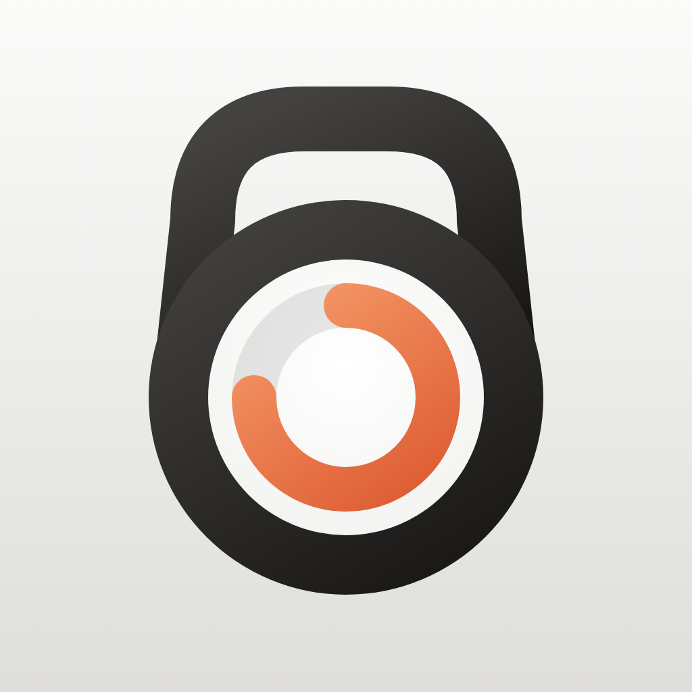 | 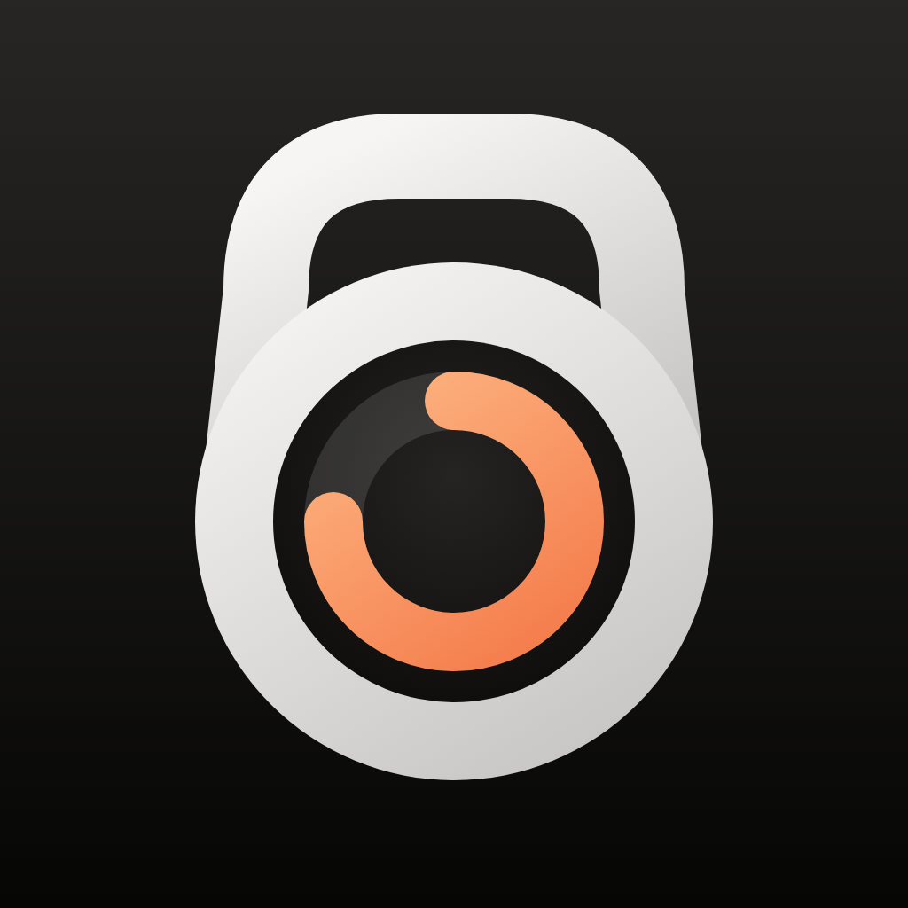 |  | 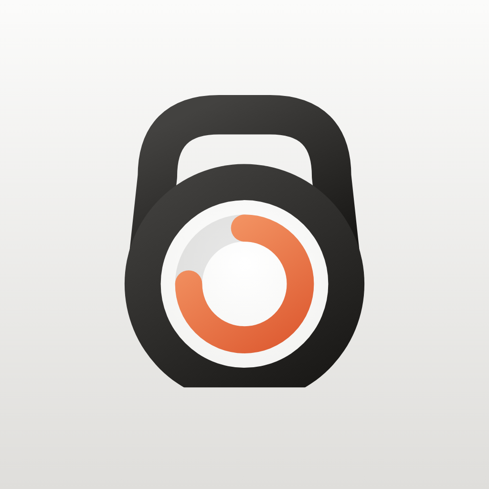 |

The icons are generated by `Branding/build-icons.mjs` (see below).

## Screenshots

| Start | Rest | Last seconds | Go! | Dark mode |
|:---:|:---:|:---:|:---:|:---:|
| 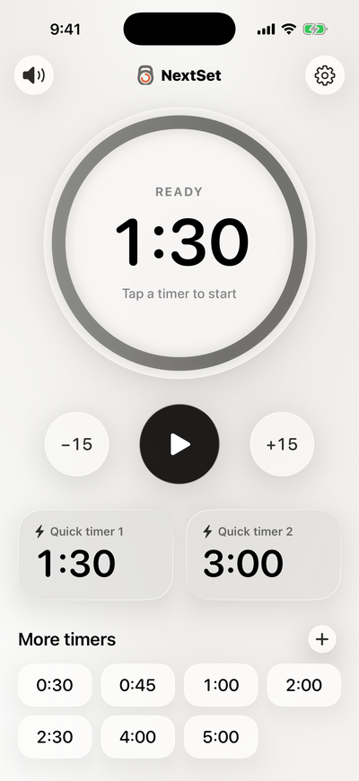 | 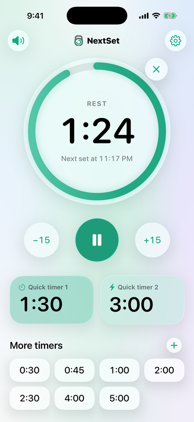 | 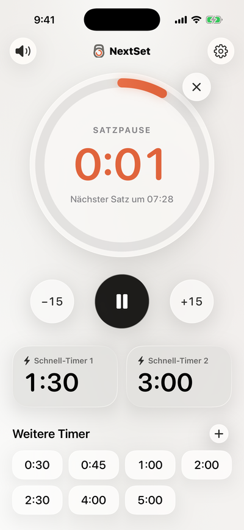 | 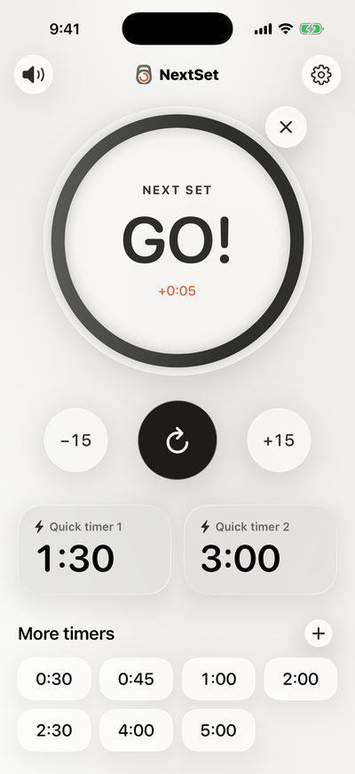 | 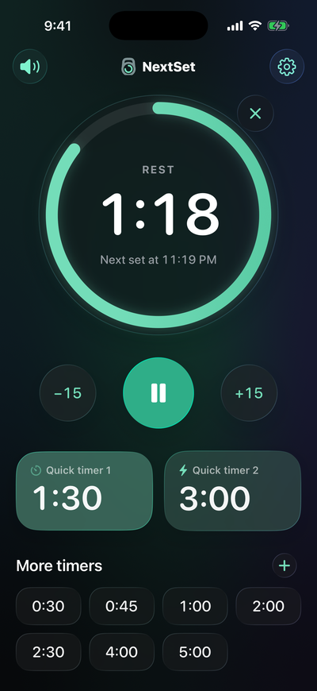 |

| Settings | Watch: start | Watch: rest | Watch: last seconds | Watch: go! |
|:---:|:---:|:---:|:---:|:---:|
| 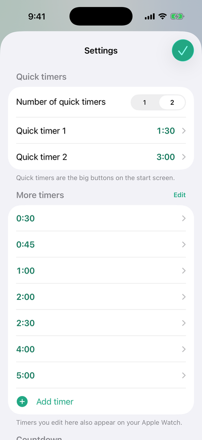 | 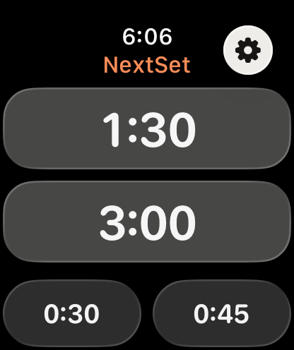 | 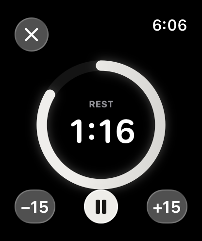 | 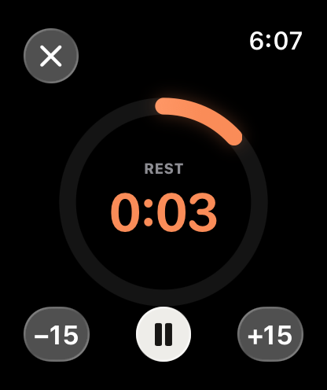 | 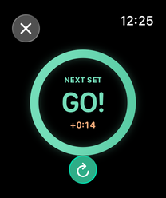 |

The screenshots come from the iOS 26 and watchOS 26 simulators (CI workflow with `-demo` launch arguments).

## Features

**Quick to start**
- 1 or 2 **quick timers** as big buttons; one tap starts the rest (default: 1:30 and 3:00)
- **More timers** in a grid below, also started with one tap (default: 0:30 to 5:00, up to 12)
- While resting, just tap another timer to switch
- **±15 s** during the rest, pause/resume, end the rest early
- After the end the app shows "GO!" and counts the time over (`+0:12`). "Repeat" starts the same rest again; ±15 s sets a different duration first.

**Countdown with haptics & sound** (adjustable in the settings)
- Signal during the last **3 (default), 5 or 10 seconds**, or off
- **Haptics** on/off. iPhone: strong Core Haptics patterns. Watch: Taptic Engine.
- **Sounds** on/off, three styles (**Beep**, **Chime**, **Digital**). They are synthesised at runtime. On the iPhone they play over your music, which briefly gets quieter, and also in silent mode. The speaker button at the top left mutes them right away.

**iPhone**
- Liquid Glass design (iOS 26): the dial as a glass disc, quick timers as tinted glass tiles, glass buttons and toolbar over a soft mesh gradient refracted by the glass
- Follows the system's light and dark mode; graphite as the accent, coral for the last seconds, large digits in SF Rounded
- **Live Activity** on the Lock Screen, in the Dynamic Island and in the Apple Watch Smart Stack
- **Notification** at the end of a rest while the app is in the background; as a time-sensitive notification it also comes through a Focus
- **Display stays on** while a rest runs (can be turned off)
- **Siri, Shortcuts & Action button**: "Start Quick Timer", "Start Rest Timer" (any number of seconds), "End Rest". By voice, e.g. "Siri, start a rest in NextSet", "Start Quick Timer 2 in NextSet" or "Stop NextSet".
- Rename timers (e.g. "Squats"), reorder or delete them. A long press on a timer opens the context menu.

**Apple Watch**
- Big quick timers right on the start screen, more timers below
- Full-screen ring with countdown, ±15 s, pause and "Repeat"; Always On display
- Keeps running with the arm lowered thanks to an *extended runtime session*. The notification at the end of a rest is always due as well, so the end also reaches the wrist if watchOS holds back the app's own haptics in the background.
- Timers are **synced** with the iPhone via WatchConnectivity and can be edited on both devices. A new watch first fetches the timers from the iPhone, so its default timers don't replace them.
- The **running rest** is synced too: starting, pausing, ±15 s and ending on the iPhone or the watch carries over to the other device, and both count down together. If the other app can't be reached at that moment, it picks up the state the next time it starts.

**Android & Wear OS** (same features, done the Android way)
- Material 3 in graphite & coral, light and dark mode, themed icon from Android 13
- **Live notification** with the countdown on the lock screen and in the status bar (from Android 16 as a Live Update), with pause, +15 s and end – the counterpart of the Live Activity. While a rest runs it belongs to a foreground service: from Android 17 that's the only way the app may play the countdown and the end in the background.
- **Notification** at the end of a rest, also while the app is in the background or was closed (exact alarm, also after a restart of the device)
- **App shortcuts** instead of Siri: a long press on the app icon starts the quick timers or ends the rest; the shortcuts can also be placed on the home screen
- **Wear OS:** quick timers and more timers on the watch, full-screen ring, Always On; a foreground service with an *Ongoing Activity* keeps the countdown running with the arm lowered, and the rest also shows on the watch face. Swiping away ends the rest.
- Timers are synced between phone and watch via the *Wearable Data Layer*
- The app language can be chosen in the Android settings (English or German)

The apps are localized in English and German.

## Getting started

### iOS

Requirements: **Xcode 26** or later, **iOS 26** / **watchOS 26**.

1. Open `ios/NextSet.xcodeproj`
2. The team is set in the project. If you build with a different developer account, choose your team in Xcode under *Signing & Capabilities*. `BUNDLE_ID_PREFIX` in `ios/Config/Signing.xcconfig` changes the bundle IDs (currently `com.mariokernich.nextset`).
3. Run the **NextSet** scheme on the iPhone. The watch app is installed along with it. The **NextSetWatch** scheme runs the watch app on its own.

> Note: on the watch the app uses an extended runtime session of type *Physical Therapy* (`WKBackgroundModes`), so the haptics keep coming with the wrist lowered. The session needs a signed build, i.e. with a team set. watchOS rejects unsigned builds, e.g. from CI; then the notification at the end of the rest takes over.

### Android

Requirements: **Android Studio** (2026.1 or later) with Android SDK 37. The apps run on **Android 10** (phone) and **Wear OS 3** (watch) or later and target Android 16.

1. Open the `android/` folder in Android Studio
2. Run the **app** configuration on a phone or emulator, **wear** on a watch or Wear OS emulator
3. For the sync between phone and watch both need Google Play services and the same signature (debug builds from the same machine match)

## Project structure

```
ios/                    Xcode project (iPhone, Apple Watch, widget)
  NextSet/              iPhone app (screens, Live Activity, App Intents)
  NextSetWatch/         Apple Watch app
  NextSetWidgets/       Widget extension for the Live Activity
  Core/                 Shared by iPhone & watch: timer logic, store, haptics, sounds, sync
  Shared/               Shared by all targets: colours, logo, ring, formatting, strings (de/en)
  NextSetTests/         Unit tests (Swift Testing)
  Config/               Info.plist additions, entitlements, Signing.xcconfig and App Store export options
  scripts/              Simulator screenshot script, App Store submission
android/                Gradle project (phone, Wear OS)
  core/                 Shared by phone & watch: timer logic, store, haptics, sounds, sync, alarm, ring & logo, strings (de/en)
  app/                  Phone app (screens, live notification, app shortcuts)
  wear/                 Wear OS app (screens, foreground service with Ongoing Activity)
Branding/               Logo, icons and banner with their generator, Google Play assets
website/                Support page and privacy policy (mariokernich.github.io/nextset)
```

On both platforms the timer always works with absolute points in time (`endDate` and `endAt`), not with a running counter. That keeps it right even when the app is paused in the background or restarted. `CountdownPlan` plans the countdown events, `TimerStore` plays them.

## Development

- **Tests:** in `ios/` run `xcodebuild test -project NextSet.xcodeproj -scheme NextSet -destination 'platform=iOS Simulator,name=iPhone 17'`
- **Screenshots:** after a test run with `-derivedDataPath build`, run `scripts/screenshots.sh build screenshots` in `ios/`. Launch arguments select the states, e.g. `-demo running`.
- **Android tests and builds:** in `android/` run `./gradlew :core:testDebugUnitTest :app:assembleDebug :wear:assembleDebug`. The unit tests in `core` run on the JVM, without an emulator.
- **Android screenshots:** debug builds take the same states as iOS, e.g. `adb shell am start -n com.mariokernich.nextset/.MainActivity --es demo running` (watch: `…/com.mariokernich.nextset.wear.MainActivity`). Values: `idle`, `running`, `countdown` (with `--el demoEnd <Unix seconds>`), `paused`, `finished`, `settings`.
- **Regenerate the icons:** `cd Branding && npm install --no-save playwright && node build-icons.mjs`
- **Website:** `website/` holds the support page and the privacy policy, in English and in German under `de/`. `.github/workflows/website.yml` publishes them with GitHub Pages at [mariokernich.github.io/nextset](https://mariokernich.github.io/nextset/) on pushes to `main`; to run it by hand use *Actions → Website → Run workflow*. For this, *Pages → Source* is set to *GitHub Actions* in the repository settings.
- **CI:** `.github/workflows/ios.yml` builds all targets on a macOS 26 runner and runs the tests on pushes to `main` and on pull requests that change something under `ios/`. It uses the newest Xcode 27 on the runner image, or the image's default Xcode while there is none. Simulator screenshots are available on demand: *Actions → iOS → Run workflow* (all, iPhone only or watch only); they are attached to the run. `.github/workflows/android.yml` tests and builds the Android apps on a Linux runner when something under `android/` changes.

## App Store

`.github/workflows/app-store.yml` archives the app with the watch app and the widget, uploads the build to App Store Connect and, if asked, submits it for review: *Actions → App Store → Run workflow*, with *Submit for App Review* ticked to submit. The build number is the workflow's run number plus 1, because build 1 came from Xcode.

For this the workflow needs an App Store Connect API key once:

1. In App Store Connect under *Users and Access → Integrations → App Store Connect API → Team Keys*, create a key with the **Admin** role, so Xcode may create certificates and profiles, and download the `.p8` file. It can only be downloaded once.
2. In the repository under *Settings → Secrets and variables → Actions*, add three secrets: `ASC_KEY_ID` (key ID), `ASC_ISSUER_ID` (issuer ID above the list of keys) and `ASC_KEY_P8` (the full contents of the `.p8` file).

The iPhone and watch apps use time-sensitive notifications (capability *Time Sensitive Notifications*, see `ios/Config/*.entitlements`). Automatic signing adds it to the App IDs when archiving; if the workflow rejects the profile, turn it on for both App IDs in the developer portal under *Identifiers*.

Submitting only works once everything else is done in App Store Connect: agreements, tax and banking, trader status under the Digital Services Act, App Privacy, age rating, texts and screenshots. If something is missing, the workflow lists it in the log.

## Google Play

The phone and watch apps are **one** listing in the Play Console (package name `com.mariokernich.nextset`); the Wear OS app gets its own release track through the *Wear OS* form factor. The version numbers are in `android/gradle.properties` (raise `nextset.versionCode` for every release, `nextset.versionName` as on iOS). Store graphics, screenshots and listing texts are in `Branding/play/`.

**Create the upload key** (once, keep it safe – without it no updates can be uploaded):

```
keytool -genkeypair -v -keystore nextset-upload.jks -alias upload -keyalg RSA -keysize 4096 -validity 10000
```

Locally, Gradle reads the key from `android/keystore.properties` (listed in `.gitignore`):

```
storeFile=/path/to/nextset-upload.jks
storePassword=…
keyAlias=upload
keyPassword=…
```

`./gradlew :app:bundleRelease :wear:bundleRelease` then builds the signed bundles in `android/*/build/outputs/bundle/release/`. Alternatively, add the repository secrets `NEXTSET_KEYSTORE_BASE64` (`base64 -i nextset-upload.jks`), `NEXTSET_KEYSTORE_PASSWORD`, `NEXTSET_KEY_ALIAS` and `NEXTSET_KEY_PASSWORD` and start *Actions → Android → Run workflow* with *Signed release bundles* ticked; the `.aab` files are attached to the run. The first version has to be uploaded in the Play Console by hand, with *Play App Signing* turned on.

To declare in the Play Console:
- **Exact alarms:** the app uses `USE_EXACT_ALARM` as a timer app (end of the rest to the second).
- **Foreground service (phone and Wear OS):** type *special use* – keeps the countdown and the end signal audible during a rest (phone, needed from Android 17) and noticeable on the wrist (watch); ideally with a short video.
- **Data safety:** no data is collected or shared. Privacy policy: [mariokernich.github.io/nextset/privacy](https://mariokernich.github.io/nextset/privacy/).
- **Target audience & content, rating:** as on the App Store (no ads, no login, rated for everyone).
