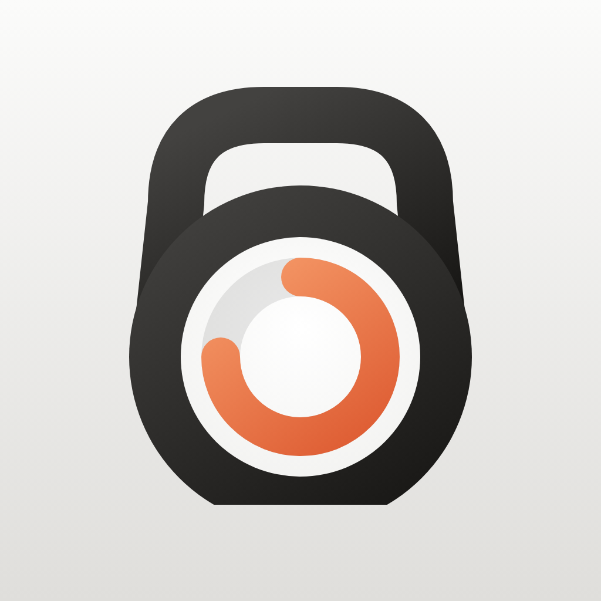
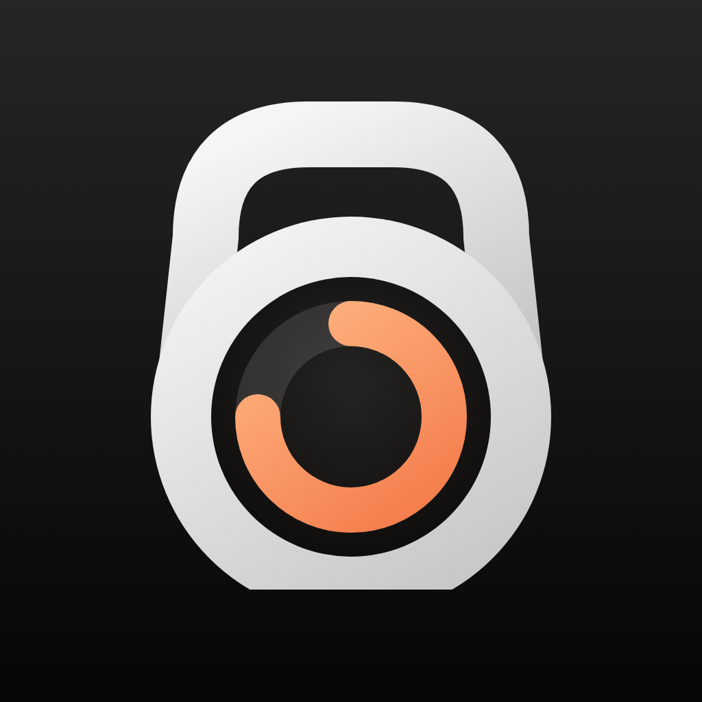
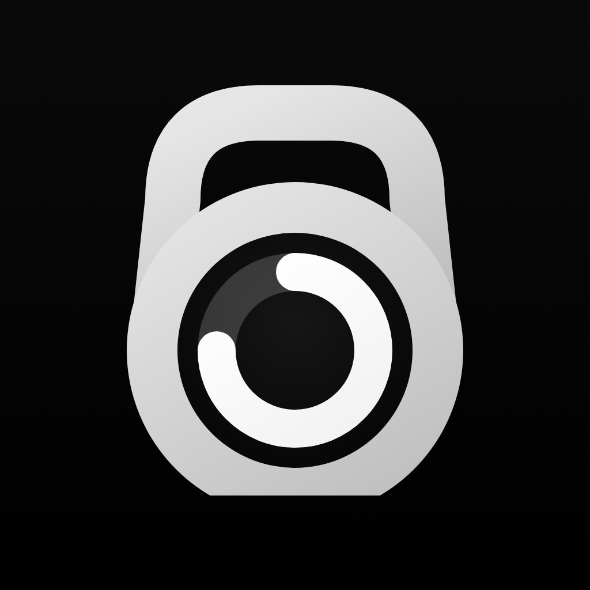
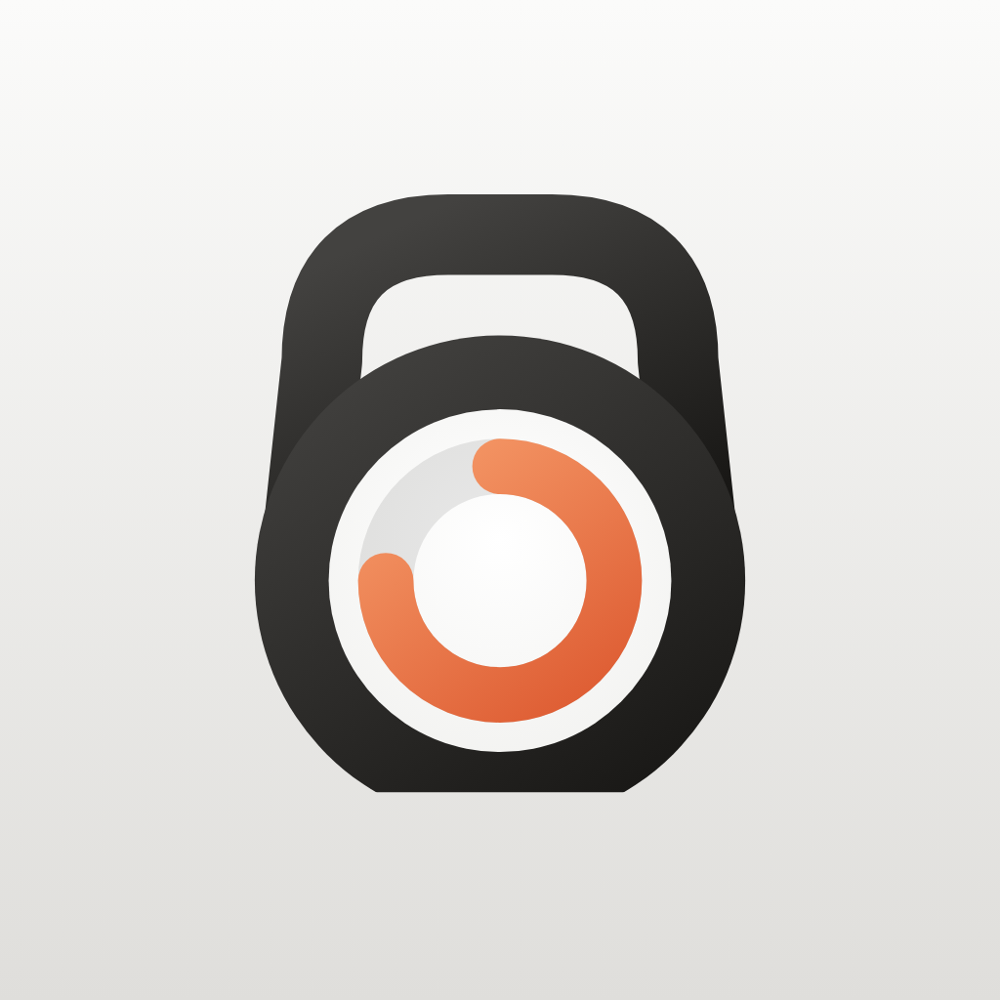

# NextSet

**Satzpausen-Timer für iPhone & Apple Watch.** Ein Tipp auf einen deiner ein bis zwei Schnell-Timer, und die Pause läuft. Die letzten Sekunden spürst du am Handgelenk oder am iPhone und hörst sie auch. Danach geht's in den nächsten Satz.

## Name & Logo

**NextSet** sagt, worum es geht: Die App sagt dir, wann dein *nächster Satz* startet. Der Claim **„Rest. Set. Go.“** ist ein Wortspiel auf „Ready, Set, Go“.

Das **Logo** ist eine Kettlebell, deren Körper gleichzeitig ein Timer-Zifferblatt ist. Griff und Kugel ergeben die Silhouette einer Stoppuhr, der Ring in Koralle zeigt die ablaufende Pause. So steht das Logo zugleich für Gym und Timer.

**Farben:** Graphit, Weiß und Glas prägen die App, sie bleibt dadurch ruhig und schlicht. Farbe gibt es nur, wenn es drauf ankommt: In den letzten Sekunden leuchten Ring und Ziffern in Koralle. Koralle ist außerdem die Farbe des Logos und der Schalter, auf der Watch auch die Akzentfarbe.

| iPhone | iPhone (dunkel) | iPhone (getönt) | Apple Watch |
|:---:|:---:|:---:|:---:|
|  |  |  |  |

Die Icons werden aus `Branding/build-icons.mjs` erzeugt (siehe unten).

## Screenshots

| Start | Satzpause | Letzte Sekunden | Los! | Dunkelmodus |
|:---:|:---:|:---:|:---:|:---:|
|  |  |  |  |  |

| Einstellungen | Watch: Start | Watch: Satzpause | Watch: Los! |
|:---:|:---:|:---:|:---:|
|  |  |  |  |

Die Screenshots stammen aus dem iOS-26- bzw. watchOS-26-Simulator (CI-Workflow mit `-demo`-Startargumenten).

## Funktionen

**Schnell starten**
- 1 oder 2 **Schnell-Timer** als große Tasten, ein Tipp startet die Pause (Standard: 1:30 und 3:00)
- **Weitere Timer** als Raster darunter, ebenfalls mit einem Tipp startbar (Standard: 0:30 bis 5:00, bis zu 12 Stück)
- Bei laufender Pause einfach einen anderen Timer antippen, um direkt zu wechseln
- **±15 s** während der Pause, Pausieren/Fortsetzen, Pause vorzeitig beenden
- Nach dem Ende zeigt die App „LOS!“ und zählt die überzogene Zeit hoch (`+0:12`). „Wiederholen“ startet dieselbe Pause erneut.

**Countdown mit Haptik & Ton** (in den Einstellungen anpassbar)
- Signal in den letzten **3, 5 oder 10 Sekunden** oder aus
- **Haptik** an/aus. iPhone: kräftige Core-Haptics-Muster. Watch: Taptic Engine.
- **Töne** an/aus, drei Klänge (**Piep**, **Glocke**, **Digital**). Sie werden zur Laufzeit synthetisiert. Auf dem iPhone laufen sie über deiner Musik, die dafür kurz leiser wird, und auch im Stumm-Modus. Stummschalten geht direkt über den Lautsprecher-Button oben links.

**iPhone**
- Liquid-Glass-Design (iOS 26): Zifferblatt als Glasscheibe, Schnell-Timer als getönte Glas-Kacheln, Glas-Buttons und -Toolbar über einem weichen Mesh-Gradient, der sich im Glas bricht
- Folgt Hell- und Dunkelmodus des Systems; Graphit als Akzent, Koralle für die letzten Sekunden, große Ziffern in SF Rounded
- **Live-Aktivität** auf dem Sperrbildschirm, in der Dynamic Island und im Smart Stack der Apple Watch
- **Mitteilung** zum Pausenende, falls die App im Hintergrund ist
- **Display bleibt an**, solange eine Pause läuft (abschaltbar)
- **Siri, Kurzbefehle & Action-Button**: „Schnell-Timer starten“, „Pausen-Timer starten“ (beliebige Sekunden), „Pause beenden“
- Timer umbenennen (z. B. „Kniebeugen“), Reihenfolge ändern, löschen. Lange drücken auf einen Timer öffnet das Kontextmenü.

**Apple Watch**
- Große Schnell-Timer direkt auf dem Startbildschirm, weitere Timer darunter
- Vollbild-Ring mit Countdown, ±15 s, Pause und „Wiederholen“; Always-On-Darstellung
- Läuft dank *Extended Runtime Session* auch bei gesenktem Arm weiter: Countdown-Taps und Ende-Signal kommen zuverlässig am Handgelenk an. Endet die Session, springt eine Mitteilung ein.
- Timer werden per WatchConnectivity mit dem iPhone **synchronisiert** und lassen sich auf beiden Geräten bearbeiten

Die App ist auf Englisch und Deutsch lokalisiert.

## Loslegen

Voraussetzungen: **Xcode 26** oder neuer, **iOS 26** / **watchOS 26**.

1. `NextSet.xcodeproj` öffnen
2. In `Config/Signing.xcconfig` deine Team-ID bei `DEVELOPMENT_TEAM` eintragen, alternativ in Xcode unter *Signing & Capabilities* ein Team wählen. Mit `BUNDLE_ID_PREFIX` passt du die Bundle-IDs an.
3. Scheme **NextSet** auf dem iPhone starten. Die Watch-App wird mitinstalliert. Für die Watch allein gibt es das Scheme **NextSetWatch**.

> Hinweis: Auf der Watch nutzt die App eine Extended Runtime Session vom Typ *Physical Therapy* (`WKBackgroundModes`). So laufen die Haptik-Signale auch bei gesenktem Handgelenk. Die Session braucht einen signierten Build, also mit gesetztem Team. Unsignierte Builds, etwa im CI, lehnt watchOS ab. Dann springt die Mitteilung am Pausenende ein.

## Projektstruktur

```
NextSet/            iPhone-App (Bildschirme, Live-Aktivität, App Intents)
NextSetWatch/       Apple-Watch-App
NextSetWidgets/     Widget-Extension für die Live-Aktivität
Core/               Gemeinsam für iPhone & Watch: Timer-Logik, Store, Haptik, Töne, Sync
Shared/             Gemeinsam für alle Targets: Farben, Logo, Ring, Formatierung, Texte (de/en)
NextSetTests/       Unit-Tests (Swift Testing)
Config/             Info.plist-Ergänzungen und Signing.xcconfig
Branding/           Logo, Icons und Banner samt Generator
scripts/            Screenshot-Skript für den Simulator
```

Der Timer rechnet immer mit absoluten Zeitpunkten (`endDate`), nicht mit einem mitlaufenden Zähler. Dadurch stimmt er auch dann, wenn die App im Hintergrund pausiert oder neu gestartet wird. Die Countdown-Ereignisse plant `CountdownPlan`, `TimerStore` spielt sie ab.

## Entwicklung

- **Tests:** `xcodebuild test -project NextSet.xcodeproj -scheme NextSet -destination 'platform=iOS Simulator,name=iPhone 17'`
- **Screenshots:** nach dem Testlauf mit `-derivedDataPath build` einfach `scripts/screenshots.sh build screenshots` ausführen. Die Zustände lassen sich per Startargument wählen, z. B. `-demo running`.
- **Icons neu erzeugen:** `cd Branding && npm install --no-save playwright && node build-icons.mjs`
- **CI:** `.github/workflows/ci.yml` baut bei Pushes auf `main` und bei Pull Requests alle Targets auf einem macOS-26-Runner und führt die Tests aus. Reine Doku-Änderungen werden übersprungen. Screenshots vom Simulator gibt es auf Knopfdruck: *Actions → CI → Run workflow* (alle, nur iPhone oder nur Watch). Sie landen als Artefakt am Lauf. Hinweis: Bei privaten Repos zählen macOS-Minuten zehnfach zum Actions-Kontingent.
